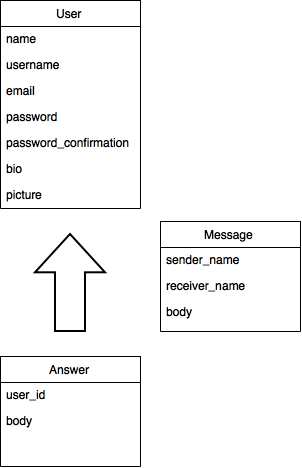

#Pair Programming
##Description
Pair Programming is a dating app for programmers! Our app compares users' answers to our questionnaire to find their best matches! The live site can be found <a href="https://pair-programming-1.herokuapp.com">here</a>. The link to our Trello board can be found <a href="https://trello.com/b/G3z6GxJ4/pair-programming">here</a>.
##Features
- To sign up, users submit:
	- username,
	- email,
	- password.
- Users' passwords are encrypted using the <a href="https://rubygems.org/gems/bcrypt-ruby/versions/3.1.5">bcrypt gem</a>. 
- Users can send each other private messages.
- Users can upload their own profile photos.
- Users will see their top matches on their profile page.

##Gems/Ruby Version
- ruby 2.2.0
- rails 4.2.1
- pg
- sass-rails
- uglifier
- coffee-rails
- jquery-rails
- jbuilder
- sdoc
- bcrypt
- puma
- react-rails
- cloudinary
- bybug
- pry
- web-console
- spring
- rails-assets-underscore
- rails-assets-backbone
- rails-assets-react
- rails-assets-moment
- rails-assets-validator
- rails_12factor

##UMLs

##Credits
The frontend of this app was created by <a href="https://github.com/awg24">Allen Garcia</a>, the design of this app was created by <a href="https://github.com/ChrisDJordan">Chris Jordan</a>, and the backend of this app was created by <a href="https://github.com/mlgiardina">Matthew Giardina</a>. 

Special thanks to <a href="https://github.com/mikepitre">Mike Pitre</a> and <a href="https://github.com/samkap">Sam Kapila</a> for their input.

